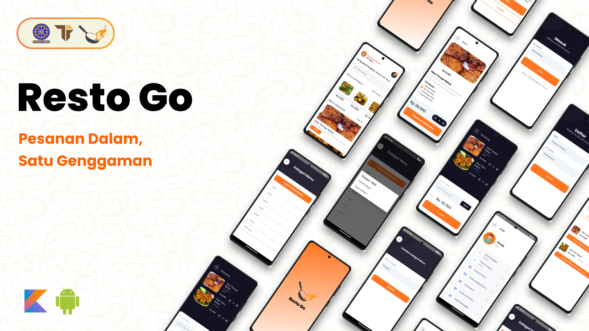

# RestoGo Android App



Resto Go adalah sebuah aplikasi Android untuk melakukan manajemen pesanan makanan berbasis API. Aplikasi ini memungkinkan pengguna untuk melihat dan mengelola pesanan makanan mereka.

API dari Resto Go dapat diakses pada [Repositori Backend RestoGo](https://github.com/ekaputra04/backend-resto-go).

[Klik disini](https://drive.google.com/file/d/1aYP7EggwjF7KRldiK_LII_n9Le5ve7h_/view?usp=sharing) untuk melihat video demonstrasi aplikasi.

## Oleh

| Nama                      | NIM        | Github                                    |
| :------------------------ | :--------- | :---------------------------------------- |
| Resandy Prisadana         | 2205551050 | [Github](https://github.com/PRisadana)    |
| I Putu Eka Putra Juniawan | 2205551087 | [Github](https://github.com/ekaputra04)   |
| Sultan Azizul Haromain    | 2205551155 | [Github](https://github.com/sultanazizul) |

Pemrograman Mobile A

Teknologi Informasi - Universitas Udayana - 2024

## Instalasi

1. Clone repositori dari GitHub:

```bash
git clone https://github.com/ekaputra04/resto-go-android.git
```

2. Buka proyek menggunakan Android Studio.

3. Jalankan proyek ke emulator atau perangkat Android.

## Fitur

### Bagi Pelanggan

- Register
- Login
- Melihat Menu
- Memilih Menu
- Memasukkan Kode Kupon
- Membuat Pesanan
- Melihat Daftar Pesanan
- Update Nama & Nomor Telepon

### Bagi Admin

- Login
- Update Nama & Nomor Telepon
- CRUD Kupon
- CRUD Extra Menu
- CRUD Kategori Menu
- CRUD Menu
- Read Pesanan

## Teknologi dan Library

- `Kotlin`: Bahasa pemrograman utama.
- `Retrofit`: Library HTTP client untuk berkomunikasi dengan API.
- `Glide`: Library untuk memuat dan menampilkan gambar.
- `RecyclerView`: Komponen UI untuk menampilkan daftar data dalam format list.

# Terima Kasih
